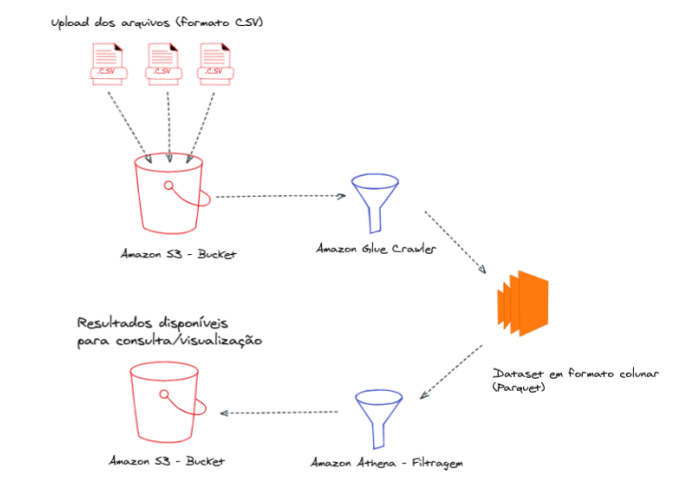

# Pipeline Censo Escolar 2020

Um pipeline de dados é um conjunto de processos que têm como objetivo final viabilizar a visualização e a análise de dados. Este repositório descreve o passo-a-passo adotado para a implementação de uma arquitetura *serverless* para analisar dados referentes ao [Censo Escolar 2020](https://www.gov.br/inep/pt-br/acesso-a-informacao/dados-abertos/microdados/censo-escolar). A partir dos microdados disponibilizados publicamente na Internet e do pipeline implementado, será possível filtrar os dados para determinar:
- Os 10 municípios com o maior número de pessoas no Ensino Fundamental de 9 anos;
- A distribuição de estudantes matriculados que declararam uma cor/raça (Branca, Preta, Parda, Amarela e Indígena) nos estados brasileiros 

### Arquitetura

Para construir o pipeline foi utilizada uma arquitetura *Serverless*. Neste modelo, um provedor de *cloud* será responsável por criar e gerenciar a infraestrutura de uma solução para a análise de dados do Censo Escolar 2020. O provedor utilizado é o [Amazon Web Services](https://aws.amazon.com/pt/), a plataforma de nuvem mais adotada no mundo atualmente.

Os microdados brutos do Censo Escolar 2020 referentes aos estudantes matriculados em cada região do Brasil foram armazenados no AWS S3, que consiste em uma *web store* fornecida pela AWS para o armazenamento de dados. Este serviço possui alta escalabilidade, robustez e segurança. Os microdados utilizados nesse estudo foram armazenados no formato CSV em *buckets*. Buckets são as unidades de armazenamento do S3 que nos permite categorizar os dados. Neste exemplo, foi criado um bucket para os dados brutos e um bucket para armazenar os dados após processá-los.

Antes de processar os dados, uma etapa importante é um pipeline para preparar o dado bruto para que ele possa ser posteriormente analisado. Para isso, a AWS oferece o AWS Glue. Essa ferramenta automatiza os processos de extração, transformação e carregamento de dados. Através desse serviço, é possível modelar os dados automaticamente utilizando-se um catálogo que auxilia a determinar a estrutura dos dados armazenados no Amazon S3. Para analisar os dados do Censo Escolar, foi definido um crawler utilizando o AWS Glue que é responsável por acessar o bucket do Amazon S3 contendo os dados brutos e criar as definições de uma tabela que conterá os dados unificados referentes a todos os estudantes matriculados que participaram do Censo Escolar. Essa tabela será utilizada para construir as *queries* que irão retornar os resultados das perguntas que queremos responder após implementar o pipeline, conforme apresentado na introdução.

Para fazer buscas na tabela definida pelo AWS Glue, foi utilizado o Amazon Athena. O Amazon Athena é im serviço de query que facilita a análise de dados armazenados no Amazon S3. Assim como toda a arquitetura implementada para construir o pipeline, o Athena não requer um setup pŕevio - o que significa que os dados podem ser analisados imediatamente utilizando SQL. Os resultados das queries foram redirecionados para o Amazon S3 e armazenados em um bucket. O diagrama abaixo ilustra a arquitetura utilizada para criar consultas para os dados do Censo Escolar.




### Queries utilizadas

Após executar o *crawler* no AWS Glue, os dados do Censo Escolar das cinco regiões brasileiras foram unificados e salvos em formato parquet, o que torna as consultas mais eficientes. As siglas para os municípios das escolas que participaram do Censo podem ser acessadas na coluna `co_municipio`, enquanto que a contagem dos alunos matriculados foi feita tendo como base a coluna `ID_MATRICULA`. Assim, a query seleciona essas colunas e aplica uma restrição para filtrar os alunos que estão cursando o nono ano (`TP_ETAPA_ENSIO = 41`). Para descobrir o total de alunos matriculados por município, os resultados são agrupados pela coluna `co_municipio`. A ordenação em ordem decrescente e limitada aos 10 primeiros permite buscar os dados referentes aos 10 municípios com o maior número de alunos matriculados.

```
SELECT co_municipio AS codigo_municipio,
COUNT(ID_MATRICULA) AS total_matriculados
FROM "censo_database"."censo_raw_data"
WHERE TP_ETAPA_ENSINO = 41
GROUP BY co_municipio
ORDER BY total_matriculados DESC
LIMIT 10;
``` 

Para criar uma distribuição para os estudantes que declararam raça/cor por estado brasileiro, duas `views` foram criadas. A `view` `vi_matriculados_cor_estado` seleciona as colunas que contém o codigo do estado (`co_uf`), a raça declarada (`tp_cor_raca`) e a coluna `ID_MATRICULA` para contar os estudantes. Nesta view, os estudantes que não declararam uma cor/raça não são incluídos no resultado final. A query agrupa os resultados por estado e por raça. Assim, a coluna contendo a contagem dos estudantes informará o número de estudantes naquele estado que se declararam brancos, pretos, pardos, amarelos ou indígena. A `view` `total_matriculados_estado` seleciona a coluna contendo o código do estado e faz uma contagem dos estudantes através da coluna ID_MATRICULA. Os resultados são agrupados pelo código do estado para calcular o total de estudantes matriculados **por estado**. Com isso, é possível combinar as duas `views` utilizando a função `JOIN` para dividir o total de estudantes que declararam raça por estado pelo total de estudantes matriculados no respectivo estado para calcular o percentual de estudantes que se declararam brancos, pretos, pardos, amarelos ou indígena em cada estado. O resultado final foi ordenado pelo código do estado e pela cor/raça declarada para facilitar a visualização.
```
SELECT mc.codigo_estado,
mc.tp_cor_raca,
mc.total_matriculados,
ROUND(CAST(mc.total_matriculados AS DOUBLE) * 100 / CAST(me.total_matriculados AS DOUBLE), 2) AS percentual_matriculados_estado
FROM "censo_database"."vi_matriculados_cor_estado" mc
JOIN "censo_database"."vi_total_matriculados_estado" me ON
mc.codigo_estado = me.codigo_estado
ORDER BY mc.codigo_estado, mc.tp_cor_raca ASC;
``` 
Os resultados obtidos após executar foram salvos em formato .CSV e podem ser visualizados na pasta`/output_results`. As siglas dos municípios e estados podem ser consultadas no site do IBGE. A tabela abaixo apresenta a classificação de cor/raça disponibilizada pelo Censo Escolar 2020.

Sigla | Cor/raça 
---| ---
1 | Branca
2 | Preta 
3 | Parda 
4 | Amarela 
5 | Indígena

### Possíveis análises

Com base nos resultados obtidos através das queries descritas acima, uma análise interessante seria cruzar os resultados dos municípios com o maior número de pessoas no Ensino Fundamental de nove anos com a distribuição de cor/raça. O objetivo é descobrir se há alguma relação entre a escolaridade e a raça declarada nas cidades com o maior número de estudantes matriculados no ensino fundamental de nove anos. Essa informação poderia auxiliar a traçar metas para tornar a educação tradicional mais inclusiva nos municípios.

### A arquitetura é adequada para trabalhar com dados 10000 maior?

Dados muito volumosos podem ter diferentes formatos. Assim recomenda-se fazer algumas alterações na arquitetura proposta com o objetivo de otimizar recursos e automatizar tarefas para disponibilizar os dados de forma mais eficiente para toda a organização.
Uma arquitetura *Serverless* pode ser utilizada para armazenar um volume grande de dados de forma escalável e para disponibilizá-los rapidamente para análises. Para que a arquitetura proposta seja viável em um cenário com dados 10000 vezes maior, seria interessante acrescentar camadas de pipeline para reconhecer e processar dados estruturados e não-estruturados. A injeção de dados nesse exemplo foi feita de forma manual, o que consumiria muito tempo para um conjunto de dados muito volumoso. A AWS oferece funções e APIs que podem automatizar essa etapa conforme a maneira que os dados serão coletados (em bateladas ou tempo real).
